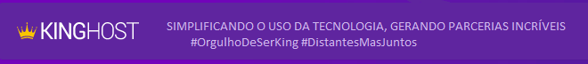

    <h1 align="center">

Desafio KingHost - Assistente de Desenvolvimento
<h2>- OBS: Como houve perda do repositório original, este contém apenas um versionamento.</h2>__

</h1>

## Índice 

- [Sobre](#-Sobre)
- [Tecnologias Utilizadas](#-Tecnologias-Utilizadas)
- [Como Baixar o Projeto](#-Como-Baixar-o-Projeto)
---
## 📝 Sobre

A página **Desafio KingHost - Assitente de Desenvolvimento** foi escrita com o intuito de demonstrar as noções básicas solicitadas como pré-resquitos para a posição de Assistente de Desenvolvimento.
___
## 💻 Tecnologias Utilizadas:

O Projeto foi desenvolvido utilizando as seguintes tecnologias: 

- HTML
- [Framework Bootstrap no CSS](https://getbootstrap.com.br/)
- [Biblioteca Jquery para o Javascript](https://code.jquery.com/)
- Ajax Para as Requisições da **[API](https://rickandmortyapi.com/)** previamente disponibilizada no processo de seleção

___
## 📁 Como Baixar o Projeto:

Acessar: 
- https://github.com/Vinibrendel/desafiorickandmorty 
- Clonar o projeto
- Entrar na pasta desafiorickandmorty
- Duplo clique em index.html 
___
**Desenvolvido por:** Vinicius Brendel
- **Informações e contato profissional: [Linkedin](https://linkedin.com/in/vinicius-brendel)**
___

